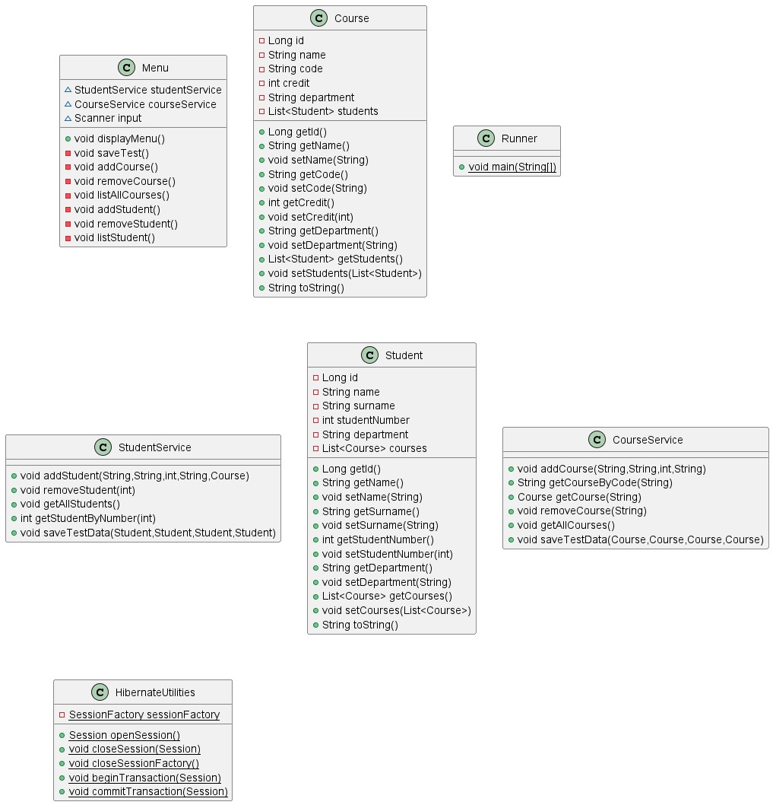

# Öğrenci ve Ders Uygulaması

Bu uygulama, iki sınıf olacaktır: Student ve Course. Student sınıfı, bir öğrencinin adını, soyadını, numarasını ve
bölümünü içerecektir. Course sınıfı, bir dersin adını, kodunu, kredisini ve bölümünü içerecektir. Bu iki sınıf arasında
bir "many to many" ilişkisi olacaktır. Yani, her öğrenci birden fazla derse kayıt olabilir ve her ders birden fazla
öğrenciye ait olabilir.

## İçindekiler
- [Yapılış Videosu](#yapılış-videosu)
- [Entity Sınıfları](#entity-sınıfları)
- [Student Sınıfı](#student-sınıfı)
- [Course Sınıfı](#ilişki)
- [StudentService Sınıfı](#studentservice-sınıfı)
- [CourseService Sınıfı](#courseservice-sınıfı)
- [Menü Sınıfı](#menü-sınıfı)



## Yapılış Videosu

- [Java Hibernate - Student Course App - 1](https://youtu.be/IBlwRKwN_Mk)
- [Java Hibernate - Student Course App - 2](https://youtu.be/K1gbk5fyZGs)
- [Java Hibernate - Student Course App - 3](https://youtu.be/j3ftAeW-n4w)
- [Java Hibernate - Student Course App - 4](https://youtu.be/hnASfnmJLEY)


## Entity Sınıfları

Bu uygulamada, öğrenci(Student) ve ders(Course) verilerini temsil etmek için iki adet entity sınıf kullanılmaktadır:

## Student Sınıfı

Student sınıfı, aşağıdaki değişkenleri içerecektir:

- `id`: Öğrencinin benzersiz idsi, **Long** türünde.
- `name`: Öğrencinin adı, **String** türünde ve NULL olmamalı.
- `surname`: Öğrencinin soyadı, **String** türünde ve NULL olmamalı.
- `studentNumber`: Öğrencinin numarası, **int** türünde benzersiz olmalı ve NULL olmamalı.
- `department`: Öğrencinin bölümü, **String** türünde.
- `courses`: Dersi alan öğrencilerin listesi, **List<Course>** türünde.

Ayrıca, bu sınıf `@Entity` ve `@Table` annotasyonları ile işaretlenmiştir. Bu, sınıfın bir Hibernate entity sınıfı
olduğunu ve "students" adlı bir veritabanı tablosuyla ilişkilendirildiğini belirtir.

- `@Entity`: Sınıfınızın bir Hibernate entity sınıfı olduğunu belirtir.
- `@Table`: Veritabanındaki tablo adını belirtir.
- `@Id`: Birincil anahtar alanını belirtir.
- `@GeneratedValue`: Birincil anahtarın otomatik olarak artan bir değere sahip olduğunu belirtir.
- `@Column`: Alanın adını ve diğer özelliklerini belirtir.
- `@ManyToMany` ve `@JoinTable`: Öğrenci sınıfının, ders sınıfı ile "many to many" ilişkisini belirtir. Bu, ilişkiyi
  yöneten tablonun adını ve ilişkili alanları belirtir.

## Course Sınıfı

Course sınıfı, aşağıdaki değişkenleri içerecektir:

- `id`: Dersin benzersiz idsi, **Long** türünde.
- `name`: Dersin adı, **String** türünde ve NULL olmamalı.
- `code`: Dersin kodu, **String** türünde benzersiz olmalı ve NULL olmamalı.
- `credit`: Dersin kredisi, **int** türünde ve NULL olmamalı.
- `department`: Dersin bölümü, **String** türünde ve NULL olmamalı.
- `students`: Dersi alan öğrencilerin listesi, **List<Student>** türünde.

Ayrıca, bu sınıf `@Entity` ve `@Table` annotasyonları ile işaretlenmiştir. Bu, sınıfın bir Hibernate entity sınıfı
olduğunu ve "courses" adlı bir veritabanı tablosuyla ilişkilendirildiğini belirtir.

- `@Entity` ve `@Table`: Aynı şekilde sınıfın ve tablonun adını belirtir.
- `@Id`, `@GeneratedValue` ve `@Column`: Birincil anahtar ve diğer alanlar için aynı işlevi görür.
- `@ManyToMany` ve `@JoinTable`: Ders sınıfının, öğrenci sınıfı ile "many to many" ilişkisini belirtir. `@JoinTable` ile
  bağlantı tablosunun adı ve bağlantıları belirtilir.

## İlişki

Student ve Course sınıfları arasında bir "many to many" ilişkisi vardır. Bu, bir öğrencinin birden fazla derse kayıt
olabileceği ve bir dersin birden fazla öğrenciye ait olabileceği anlamına gelir. Bu ilişkiyi modellemek için, her iki
sınıfta da bir "courses" listesi oluşturacağız.

### StudentService Sınıfı

StudentService sınıfında, "courses" listesi bir ArrayList türünde olacaktır. Bu liste, öğrencinin kayıtlı olduğu tüm
dersleri içerecektir.

- `addStudent(String name, String surname, int studentNumber, Sring department)`: Öğrenciye yeni bir ders eklemek için
  kullanılır.
- `removeStudent(int studentNumber)`: Öğrenciden bir dersi kaldırmak için kullanılır.
- `getAllStudents()`: Öğrencinin kayıtlı olduğu tüm dersleri döndürür.
- `getStudentByNumber(int studentNumber)`: Verilen öğrenci numarasına sahip bir öğrenciyi bulmak için kullanılır. Bu
  metod, öğrenci numarasını parametre olarak alır ve ilgili öğrenciyi döndürür. Eğer belirtilen öğrenci numarasına sahip
  bir öğrenci bulunamazsa, `null` değeri döndürülür.
- `saveTestData(Student student1, Student student2, Student student3, Student student4)`: Test verilerini kaydeder.

### CourseService Sınıfı

CourseService sınıfında, "students" listesi bir HashSet türünde olacaktır. Bu liste, dersin kayıtlı olduğu tüm
öğrencileri içerecektir.

- `addCourse(String name, String code, int credit, String department)`: Derse yeni bir öğrenci eklemek için kullanılır.
- `removeCourse(String code)`: Dersten bir öğrenciyi kaldırmak için kullanılır.
- `getAllCourses()`: Dersin kayıtlı olduğu tüm öğrencileri döndürür.
- `getCourseByCode(String code)`: Verilen ders koduna sahip bir dersi bulmak için kullanılır. Bu metod, ders kodunu
  parametre olarak alır ve ilgili dersi döndürür. Eğer belirtilen ders koduna sahip bir ders bulunamazsa, `null` değeri
  döndürülür.
- `saveTestData(Course course1, Course course2, Course course3, Course course4)`: Test verilerini kaydeder.

## Menü Sınıfı

Uygulamaya aşağıdaki menü eklenecektir:

1. Ders ekle
2. Ders sil
3. Dersleri listele
4. Öğrenci ekle
5. Öğrenci sil
6. Öğrencileri listele
7. Öğrenci getir
8. Test verileri oluştur
0. Çıkış

Uygulamaya bir menü eklemek için aşağıdaki kod kullanılabilir:

```java
import java.util.Scanner;

public class Menu {
        // Öğrenci sınıfı örneği oluşturma
        Student student1 = new Student("Ahmet", "Yılmaz", 111, "Bilgisayar Mühendisliği");
        Student student2 = new Student("Ayşe", "Kaya", 222, "Elektrik Elektronik Mühendisliği");
        Student student3 = new Student("Mehmet", "Öztürk", 333, "Makine Mühendisliği");
        Student student4 = new Student("Mustafa", "Yılmaz", 444, "Bilgisayar Mühendisliği");

        // Kurs oluştur
        Course course1 = new Course("Java'ya Giriş", "BM101", 3, "Bilgisayar Mühendisliği");
        Course course2 = new Course("Veritabanı Yönetimi", "BM201", 4, "Bilgisayar Mühendisliği");
        Course course3 = new Course("Elektrik Devreleri", "EE101", 3, "Elektrik Elektronik Mühendisliği");
        Course course4 = new Course("Yazılım Geliştirme", "BM301", 5, "Bilgisayar Mühendisliği");

    Scanner input = new Scanner(System.in);
    
    public void displayMenu(){
        // Menü oluşturma
        System.out.println("İşlem seçiniz:");
        System.out.println("1. Ders ekle");
        System.out.println("2. Ders sil");
        System.out.println("3. Dersleri listele");
        System.out.println("4. Öğrenci ekle");
        System.out.println("5. Öğrenci sil");
        System.out.println("6. Öğrencileri listele");
        System.out.println("7. Öğrenci getir");
        System.out.println("8. Test verileri olustur");
        System.out.println("0. Çıkış");

        // Kullanıcıdan seçim alma
        int choice = input.nextInt();

        // Seçime göre işlem yapma
        switch (choice) {
                case 1:
                    addCourse();
                    break;
                case 2:
                    removeCourse();
                    break;
                case 3:
                    listAllCourses();
                    break;
                case 4:
                    addStudent();
                    break;
                case 5:
                    removeStudent();
                    break;
                case 6:
                    listStudent();
                    break;
                case 7:
                    getStudent();
                    break;
                case 8:
                    saveTest();
                    break;
                case 0:
                    exit = false;
                    break;
                default:
                    System.out.println("Invalid choice");
                    break;
            }
    }
}
